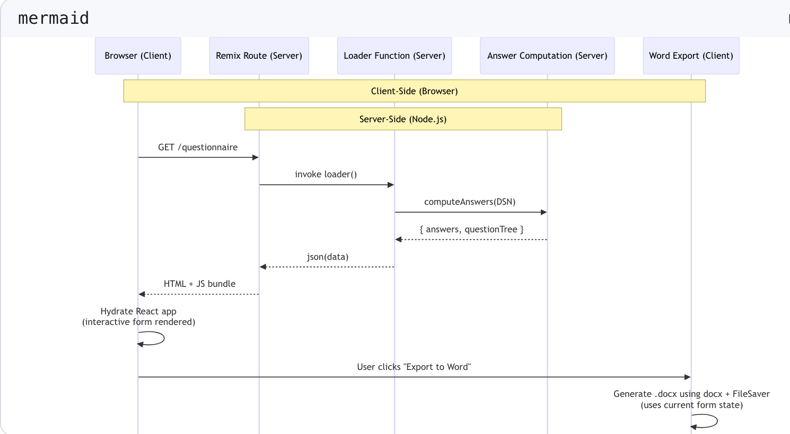

# CSRD Compliance Questionnaire System

## 1. Project Overview

This project is a Remix-based web application developed as part of a use-case assessment.  
It implements a focused **CSRD (Corporate Sustainability Reporting Directive) compliance questionnaire**, designed to process French **DSN (Déclaration Sociale Nominative)** files in order to automatically compute employee-related metrics and export them in a structured **Word (.docx)** format.

### Key Features

- Parses DSN data to compute workforce metrics, including:
  - Global and disaggregated headcount
  - Employee turnover
  - Aggregate and average values
- Renders a hierarchical questionnaire with collapsible sections for improved readability and navigation.

### Scope and Limitations

This implementation intentionally focuses on automated, server-side data processing and a read-only user interface.

- The web interface renders the CSRD questionnaire in a read-only form; values derived from DSN files cannot be modified through the UI

## 2. How to run the project 

## Prerequisites

- Docker and Docker Compose

## Configuration

The application requires the `QUESTIONS_CSV_PATH` environment variable to be set.  
This variable defines the path to the `questions.csv` file used by the application.

### Example

```env
QUESTIONS_CSV_PATH=fixtures/questions.csv
```

## With Docker (recommended)

```
# Build and start the app
docker compose up --build

# App will be available at http://localhost:3000
```

## 3. Architecture 




### Key Design Choices

#### Full-Stack Architecture with Remix (React + Node.js)
- Uses Remix’s built-in data loading and mutation mechanisms (`loaders` and `actions`) to enforce a clear separation between client and server responsibilities
- Server-side rendering ensures the initial questionnaire state is computed and hydrated securely

#### Server-Side Data Processing
- DSN file parsing, questionnaire loading (`questions.csv`), and data-mapping logic are executed exclusively on the server
- This approach prevents exposure of business rules and sensitive parsing logic to the client

#### Stateless Upload → Mapping → Form Flow
- No persistent database is used; uploaded DSN files and derived answers are stored temporarily in memory or session scope
- This design keeps the implementation lightweight and aligned with the scope of a technical case study

#### Structured Mapping Layer
- A dedicated `computeAnswers()` function maps DSN fields to CSRD questionnaire items
- Mapping strategies (e.g. direct, aggregate, transform) are explicitly defined, grouped, and documented to support clarity and future extensibility

#### Client-Side Interaction, Server-Side Export
- The questionnaire is rendered as an interactive form on the client
- Final Word (`.docx`) generation is handled server-side using a library such as `docx`, ensuring consistent and secure document output

#### Environment-Based Configuration
- The path to the questionnaire definition file (`questions.csv`) is provided via the `QUESTIONS_CSV_PATH` environment variable
- This enables flexible local configuration without requiring code changes

## 3. What's implemented 

### Core features

#### **DSN Processing**: Parses DSN files and extracts employee data
#### **Automated Computation**: Calculates global headcount, turnover, and averages
#### **Dynamic Tables**: Renders country, gender/contract, region, and category breakdowns
#### **Manual Input Support**: Editable fields for methodology questions (S1-6_14 to S1-6_17)
#### **Collapsible Sections**: Clean UI with expandable/collapsible sections
#### **Word Export**: Generates complete .docx reports with proper structure
#### **Responsive Design**: Works on desktop and mobile devices

### Quality characteristics

#### **Type Safety**: Full TypeScript coverage with precise interfaces
#### **Clear Data Flow**: Unidirectional data flow from server to client
#### **Maintainable Structure**: Separation of parsing, computation, and rendering logic
#### **User-Centric UX**: Intuitive form layout with clear computed vs manual distinction

## 3. Next Steps & Improvements

### High priority

##### Form Validation: The current form is read-only; future enhancements will allow manual editing of input fields along with corresponding validation before export.
#### State Persistence: Save user edits to localStorage to prevent data loss on refresh
#### Enhanced Export: Include collapsible section state in Word document structure
Error Boundaries: Add proper error handling for malformed DSN files
####  Audit Trail: Track changes to manual answers with timestamps

### Medium priority 

#### Multi-language Support: Complete French/English toggle
#### Accessibility: Full WCAG compliance for form controls and navigation

### Technical debt

#### CSS Organization: Current CSS is functional but could benefit from a proper design system
####  State Management: Current manual answer tracking is minimal


## 4. AI Assistance

This project leverages a **fine-tuned version of DeepSeek V3** to accelerate development and improve code quality. The AI is used for the following tasks:

- **Documentation generation:** Automatically creates documentation from existing code, improving readability and maintainability
- **TypeScript migration:** Converts `DSNReader.js` to TypeScript, ensuring stronger type safety and reducing potential runtime errors
- **Unit test scaffolding:** Generates basic unit tests to verify core functionality and support future test coverage
- - **Code review support:** Provides cursory feedback on code quality and suggestions for improvement


